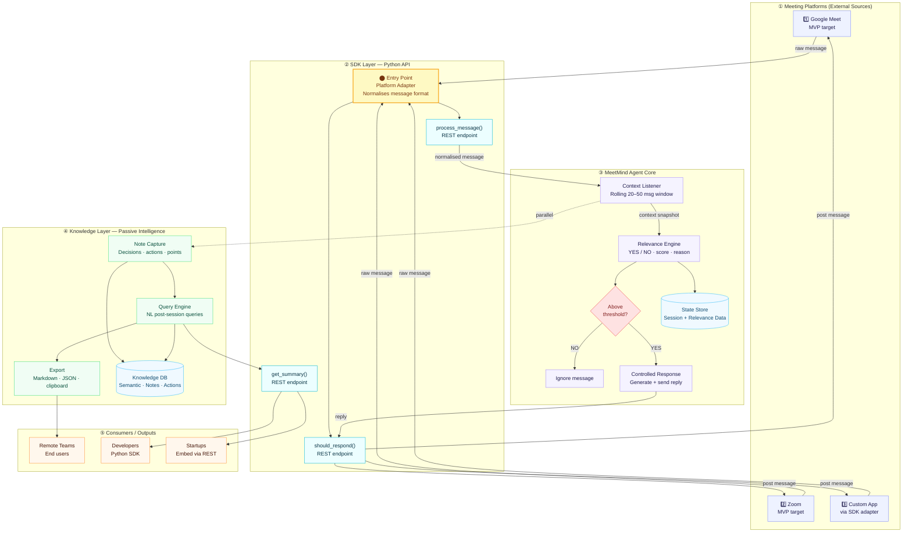

# System Architecture Overview

High-level architecture of the MeetMind platform — an intelligent meeting agent that listens, decides relevance, and captures knowledge passively.

## Layer Summary

| Layer | Responsibility |
|-------|----------------|
| ① Platforms | External meeting sources (Google Meet, Zoom, custom apps) |
| ② SDK Layer | Python API that normalises messages and exposes REST endpoints |
| ③ Agent Core | Context window management, relevance scoring, controlled responses |
| ④ Knowledge Layer | Passive note capture, NL query engine, export capabilities |
| ⑤ Consumers | End users, developers (SDK), and startups (REST embed) |
